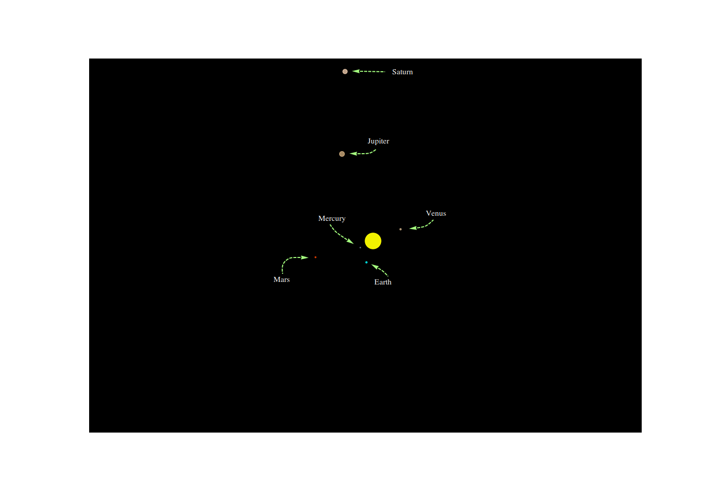
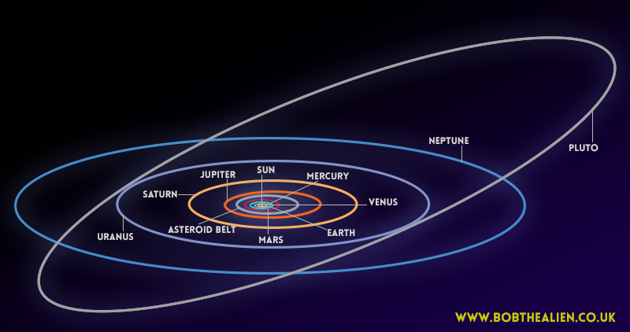

Simulation of the Sun, Mercury, Venus, Earth, Mars, Jupiter, Saturn, in that order from the center.  
After a while you will also see Pluto, which you will notice have another orbit. We are not able to get  
a look at Uranius or Neptune, but you are welcome to use the python file, to change angle, axis ect,  
if you want to have a look at those planet also. Download all files from Results, and use Solar_sim.py.
The planet sizes is a heuristics approximations.

  

    

  

