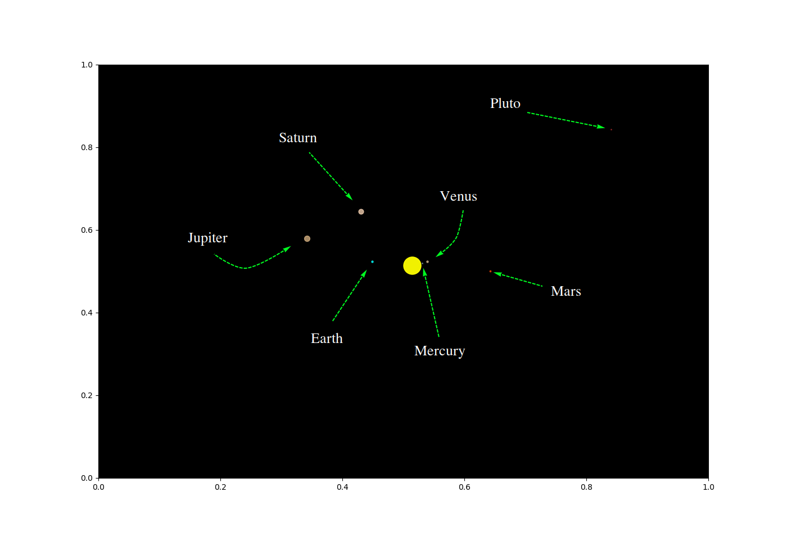

[Codes](https://github.com/endrias34/FYS4150/tree/master/src/Project-3)
  

Simulation of the Sun, Mercury, Venus, Earth, Mars, Jupiter, Saturn, Pluto in that order from the center.  
The angle is choosen in such a way that we observe as many planets as possible in this time interval.  
We encourage you to download 3D_Animation.zip from the codes-link and drag the angle around as you wish.  
You will then be able to see Uranus and Neptune also, and simulate it for a longer period of time.  
The planet sizes is a heuristics approximations.  

  

    

